# Grocery Inventory Management System

A comprehensive, dual-portal web application for managing grocery store inventory, employees, and sales, built with Java Servlets and a MySQL backend.

**Project by: Saksham Talwar**

> This project was developed as the final course-end project for the **Anudip Foundation**.  
> **Batch Code:** ANP-D0458

---

## 📖 Table of Contents

- [Project Overview](#-project-overview)
- [Key Features](#-key-features)
- [Project Images](#-project-images)
- [Technology Stack](#-technology-stack)
- [Setup and Installation](#-setup-and-installation)
- [How to Run](#-how-to-run)
- [Creating a Deployable WAR File](#-creating-a-deployable-war-file)

---

## 🚀 Project Overview

The Grocery Inventory Management System is a dynamic web application designed to streamline the inventory and employee management processes for a grocery store. It provides a robust Java Servlet backend to handle complex data operations, coupled with a modern, responsive user interface for seamless interaction.

The system features two distinct user roles, each with a dedicated portal:

- **Admin Portal**: A comprehensive dashboard for administrators to oversee all aspects of the business, including full CRUD (Create, Read, Update, Delete) functionality for products, employees, and product categories.
- **Employee Portal**: A focused dashboard for employees to manage daily tasks, including a point-of-sale (POS) system for generating customer bills, viewing product stock, and managing supplier orders.

---

## ✨ Key Features

### Admin Portal

- **Dashboard Analytics**: At-a-glance statistics for total products, employees, categories, and low-stock alerts.
- **Full Employee Management**: Add, view, edit, and delete employee records, including personal details, salary, and photo URLs.
- **Complete Product Management**: Full CRUD functionality for products, including name, description, price, quantity, category, and brand.
- **Category Management**: Add, view, and delete product categories.
- **Data Export**: Export the entire product inventory as a downloadable CSV file.
- **Real-time Information**: Displays a real-time clock for the Indian timezone and a session login timer.

### Employee Portal

- **Role-Specific Dashboard**: Displays key metrics relevant to the employee, such as total products and low-stock items.
- **Bill Generation System**: A complete point-of-sale interface to add products to a customer's bill, calculate the total, and finalize sales.
- **Product Viewing**: A read-only view of all products and their current stock levels.
- **Stock Updates**: Allows employees to directly update the quantity of a product in the inventory.
- **Supplier Order Management**: View a history of purchase orders sent to suppliers and place new orders for stock.
- **Profile Management**: Employees can view and update their own personal details.

---

## 📸 Project Images

### 1. Welcome Screen & User Registration
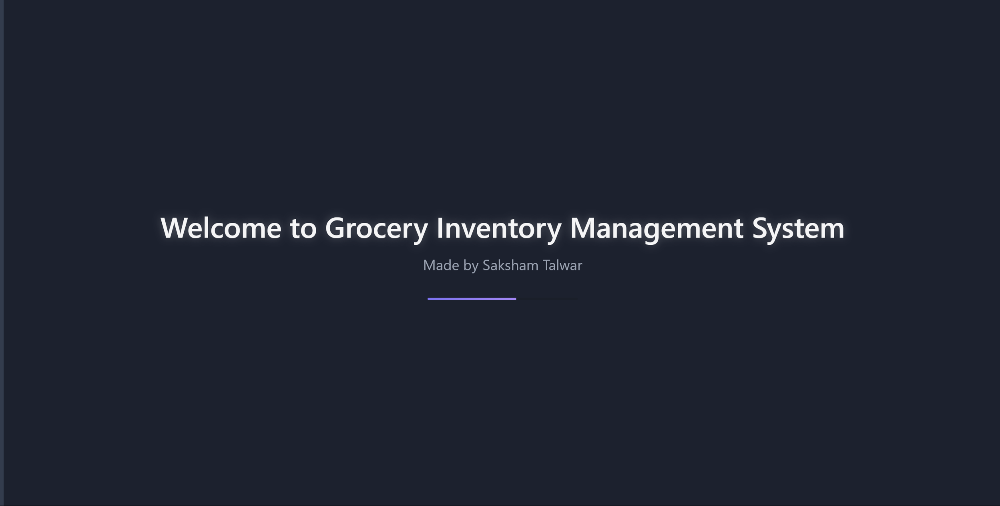
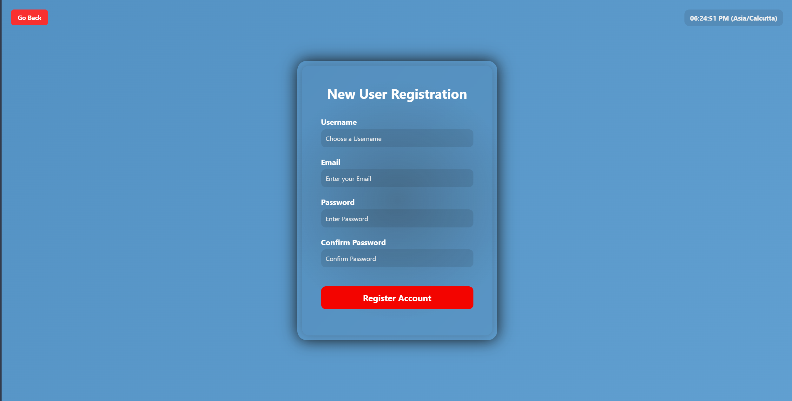

---
### 2. Employee Portal
The employee portal allows staff to manage sales, products, and their own profiles.

| Employee Login | Employee Portal |
| :---: | :---: |
| 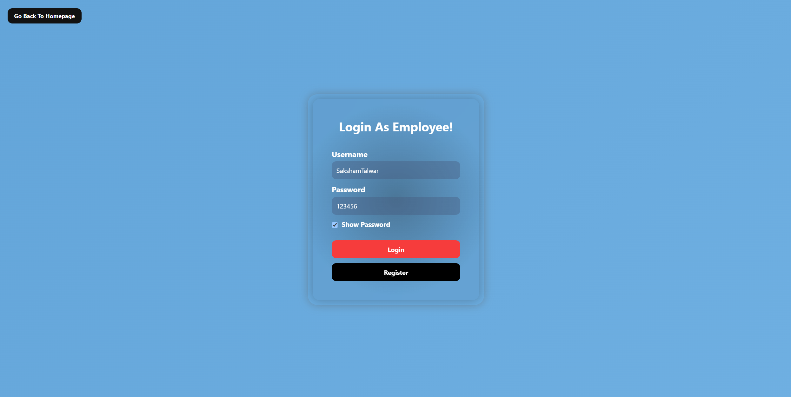 | 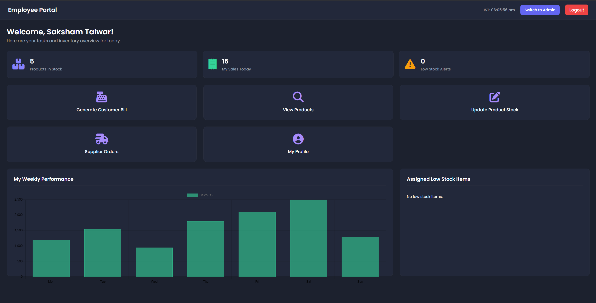 |

**Employee Functions:**
- **Generate Bill:** 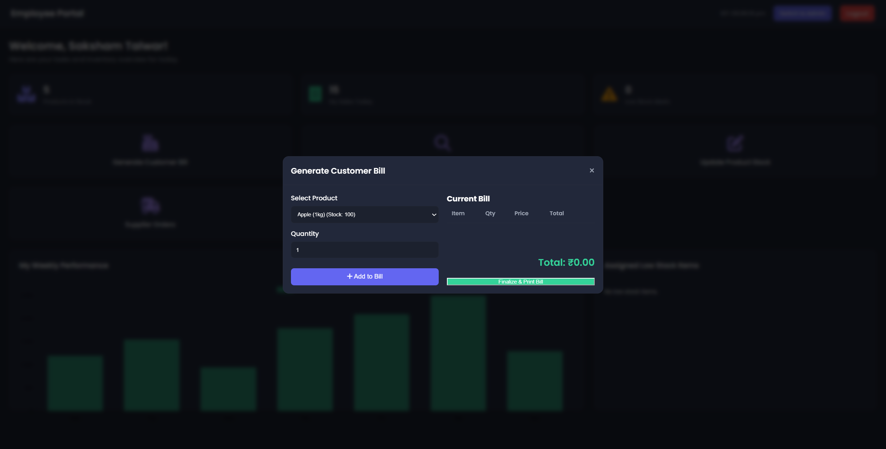
- **View Products & Update Stock:** 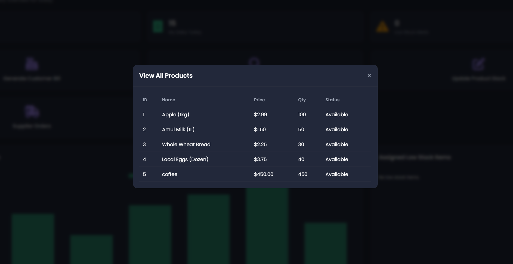 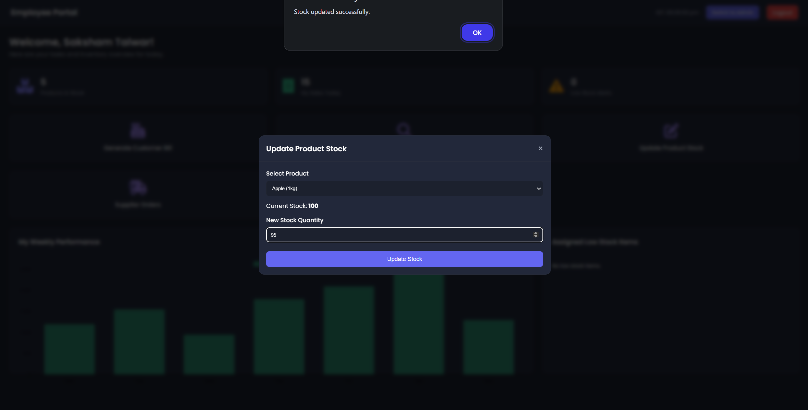
- **Update Profile Details:** 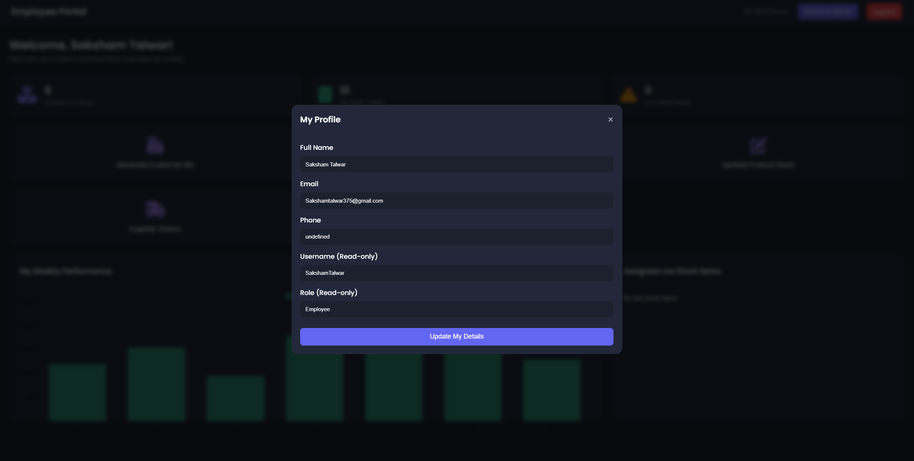

---
### 3. Admin Portal
The admin portal provides full control over employees, product categories, and data management.

| Admin Login | Employee Management |
| :---: | :---: |
| 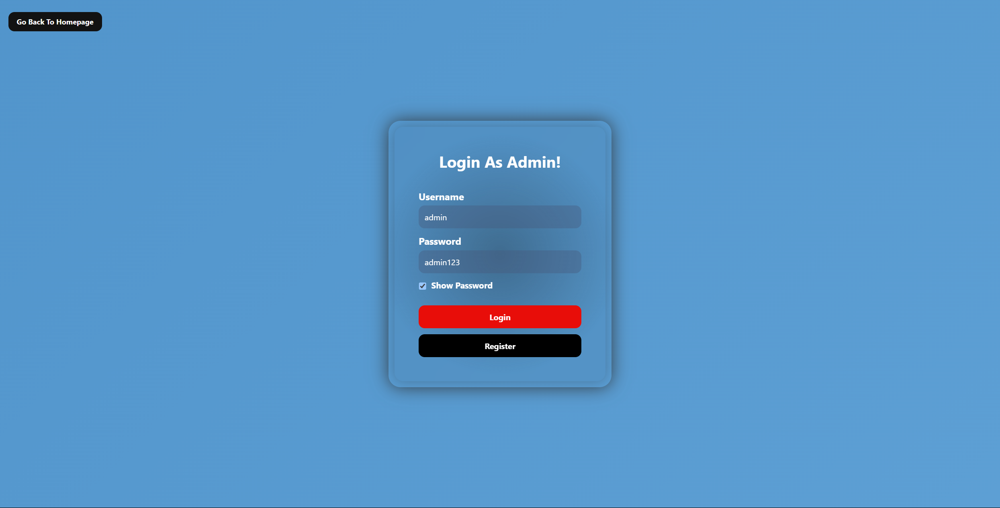 | 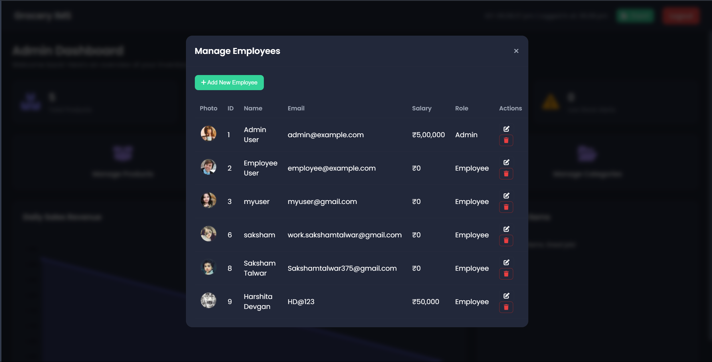 |

**Admin Functions:**
- **Add New Employee:** 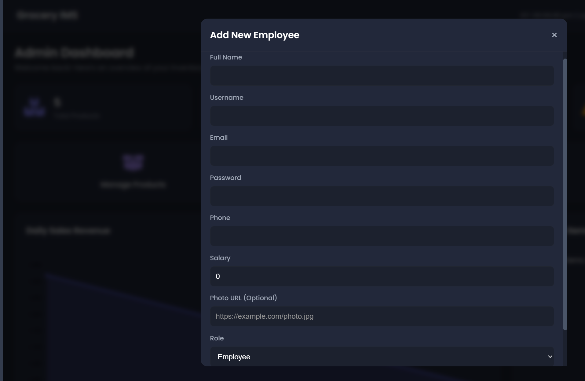
- **Manage Categories:** 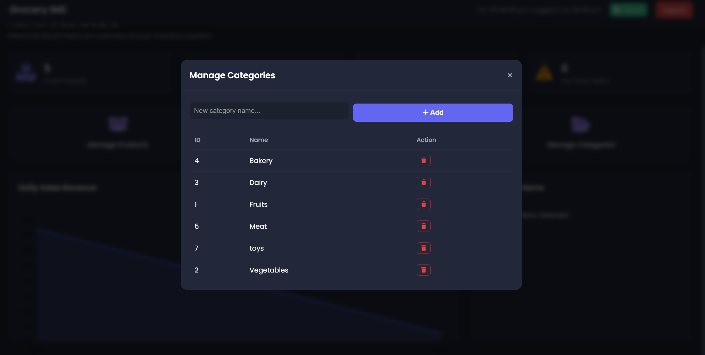
- **Export Data to CSV:** 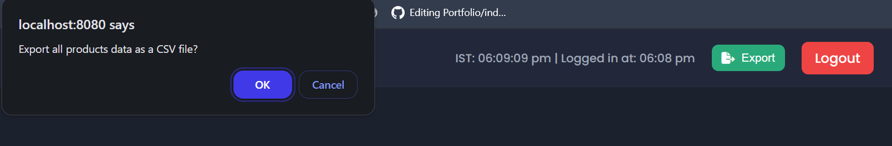

---

## 💻 Technology Stack

- **Backend**: Java Servlets, Jakarta EE 10
- **Frontend**: HTML5, CSS3, JavaScript (ES6+)
- **Database**: MySQL
- **Web Server**: Apache Tomcat 10.1
- **Java Version**: JDK 11 or newer
- **Libraries**:
  - **Gson**: For converting Java objects to JSON for API communication.
  - **Chart.js**: For rendering dynamic charts on the dashboards.
  - **Font Awesome**: For icons.

---

## 🛠️ Setup and Installation

Follow these steps to set up and run the project on a local machine.

### Prerequisites

1.  **Java Development Kit (JDK)**: Version 11 or higher.
2.  **Apache Tomcat**: Version 10.1.
3.  **MySQL Server & MySQL Workbench**.
4.  **Eclipse IDE for Enterprise Java and Web Developers**.
5.  **MySQL Connector/J**: The JDBC driver `.jar` file.

### Step 1: Database Setup

1.  Open MySQL Workbench and connect to your local database server.
2.  Open the `setup.sql` file provided with this project.
3.  Execute the entire script. This will create the `inventory_management` database, all necessary tables, and insert sample data.

### Step 2: Configure Eclipse Project

1.  Import the project into your Eclipse workspace (`File > Import > General > Existing Projects into Workspace`).
2.  Add the Tomcat 10.1 server to your Eclipse IDE via the "Servers" tab.
3.  Add the MySQL Connector/J `.jar` file to the project's build path (`Right-click project > Build Path > Configure Build Path > Libraries > Add External JARs...`).
4.  Open the `src/main/java/com/ims/util/DatabaseConnectionUtil.java` file and update the `JDBC_USERNAME` and `JDBC_PASSWORD` variables to match your MySQL credentials.

---

## ▶️ How to Run

1.  **Clean the Project**: In Eclipse, go to `Project > Clean...` and clean your project.
2.  **Run on Server**: Right-click on the project in the Project Explorer, select **Run As > Run on Server**, and choose your configured Tomcat server.
3.  **Access the Application**: The application will open in a browser at `http://localhost:8080/InventoryManagementSystem/`.

**Default Login Credentials:**

- **Admin**: `admin` / `admin123`
- **Employee**: `employee` / `employee123`

---

## 📦 Creating a Deployable WAR File

To run this project without an IDE, you can create a `.war` file and deploy it to any Tomcat server.

1.  **Export from Eclipse**: Right-click the project, select **Export > WAR file**, and save the `InventoryManagementSystem.war` file to your computer.
2.  **Deploy to Tomcat**: Copy this `.war` file into the `webapps` directory of your Tomcat installation.
3.  **Run**: Start the Tomcat server. The application will be available at `http://localhost:8080/InventoryManagementSystem/`.
